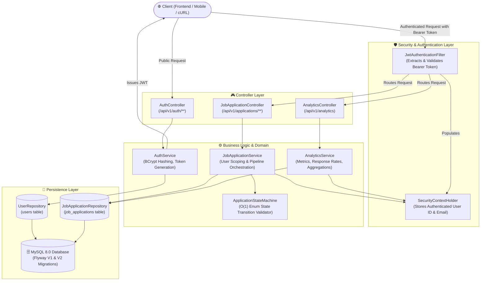
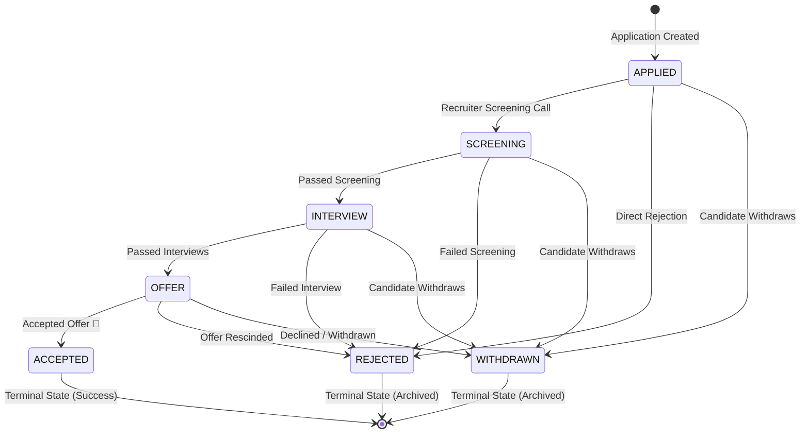
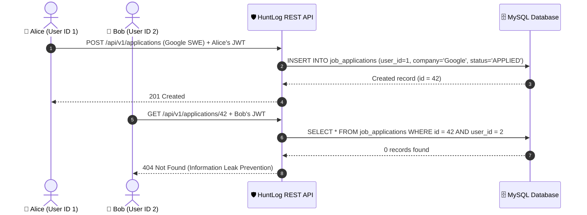
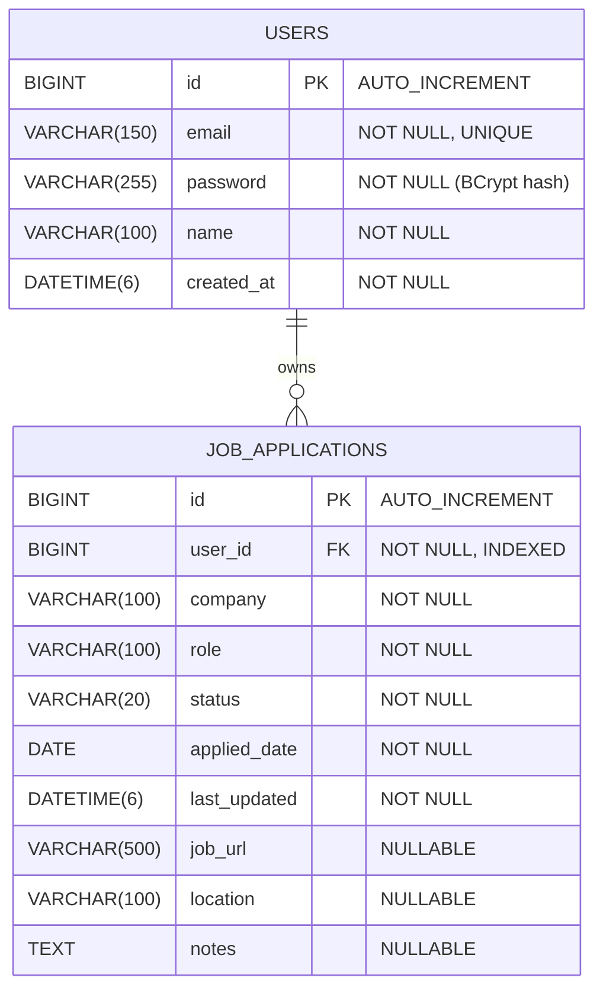

# 🏛️ HuntLog — System Architecture & Technical Design

This document details the architectural decisions, design patterns, state machine mechanics, security models, database schema, and analytics pipeline for HuntLog.

---

## 🏗️ 1. High-Level Architecture & Request Flow

HuntLog follows a layered, domain-driven Spring Boot architecture with strict separation of concerns.

---

## 🔄 2. State Machine Pipeline

HuntLog enforces hiring lifecycle rules using a deterministic finite state machine to prevent illegal status leaps (e.g., jumping directly from `APPLIED` to `OFFER`).

### Transition Matrix

| From Status | Allowed Target Statuses | Is Terminal? |
|---|---|---|
| `APPLIED` | `SCREENING`, `REJECTED`, `WITHDRAWN` | ❌ No |
| `SCREENING` | `INTERVIEW`, `REJECTED`, `WITHDRAWN` | ❌ No |
| `INTERVIEW` | `OFFER`, `REJECTED`, `WITHDRAWN` | ❌ No |
| `OFFER` | `ACCEPTED`, `REJECTED`, `WITHDRAWN` | ❌ No |
| `ACCEPTED` | *None* | ✅ Yes |
| `REJECTED` | *None* | ✅ Yes |
| `WITHDRAWN` | *None* | ✅ Yes |

### Implementation Detail
The state machine is implemented via an immutable `Map<ApplicationStatus, Set<ApplicationStatus>>` in [`ApplicationStateMachine.java`](file:///c:/projects/Huntlog/src/main/java/com/pbanakar/huntlog/statemachine/ApplicationStateMachine.java). Lookups are $O(1)$ in time complexity and zero-allocation.

Every response payload embeds `allowedNextStatuses: [...]`, enabling client frontends to dynamically render next actions without duplicating business logic.

---

## 📊 3. Analytics & Metrics Pipeline

The [`AnalyticsService`](file:///c:/projects/Huntlog/src/main/java/com/pbanakar/huntlog/service/AnalyticsService.java) executes user-scoped SQL aggregate queries to compute live insights:

- **Database-level Aggregation**: Uses Spring Data JPA `@Query` projections (`CompanyCount`) to calculate top company distribution in MySQL rather than loading all rows into Java memory.
- **Response Rate Formula**: 
  $$\text{Response Rate} = \frac{\text{Total} - \text{APPLIED} - \text{WITHDRAWN}}{\text{Total}} \times 100$$
- **Velocity Metrics**: Computes average days from submission to first status transition across non-APPLIED applications.

---

## 🔒 4. Security & Multi-Tenant Data Isolation

### Stateless Authentication
- **Algorithm**: HMAC-SHA512 (`HS512`) with 256+ bit secret keys.
- **Payload Claims**: `sub` (email), `userId` (Long), `name` (String), `iat` (issued at), `exp` (expiration).
- **Password Storage**: Passwords are encrypted with `BCryptPasswordEncoder` (salted, 10 rounds).

### Per-User Data Isolation
Every application record is tied to a `user_id` foreign key.

> 🛡️ **Privacy Guard**: Attempting to access another user's application produces a `404 Not Found` rather than `403 Forbidden`. This ensures unauthorized users cannot discover whether a specific application ID exists.

---

## 🗄️ 5. Database Schema & Flyway Migrations

Database schema versioning is managed via Flyway migrations under `src/main/resources/db/migration`:

### Entity Relationship Diagram

### Migrations Timeline
- **`V1__create_job_applications_table.sql`**: Creates initial `job_applications` table.
- **`V2__create_users_and_link_applications.sql`**: Creates `users` table, adds `user_id` column with foreign key constraint, and adds index `idx_job_applications_user_id` for fast query performance.

---

## ⚠️ 6. Global Exception & Error Handling

All controller errors are caught by [`GlobalExceptionHandler`](file:///c:/projects/Huntlog/src/main/java/com/pbanakar/huntlog/exception/GlobalExceptionHandler.java) and returned in a standard RFC 7807 format:

| Exception | HTTP Status | Meaning |
|---|---|---|
| `DuplicateEmailException` | `409 Conflict` | Email is already registered |
| `BadCredentialsException` | `401 Unauthorized` | Invalid email or password |
| `ResourceNotFoundException` | `404 Not Found` | Application not found or belongs to another user |
| `InvalidStatusTransitionException` | `422 Unprocessable Entity` | Illegal state machine status transition |
| `MethodArgumentNotValidException` | `400 Bad Request` | DTO validation failure (e.g. invalid email) |
| `HttpMessageNotReadableException` | `400 Bad Request` | Malformed JSON in request body |
