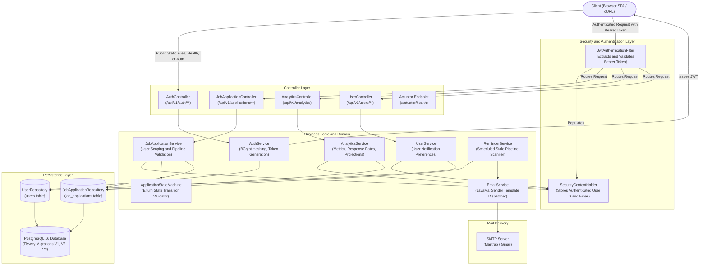
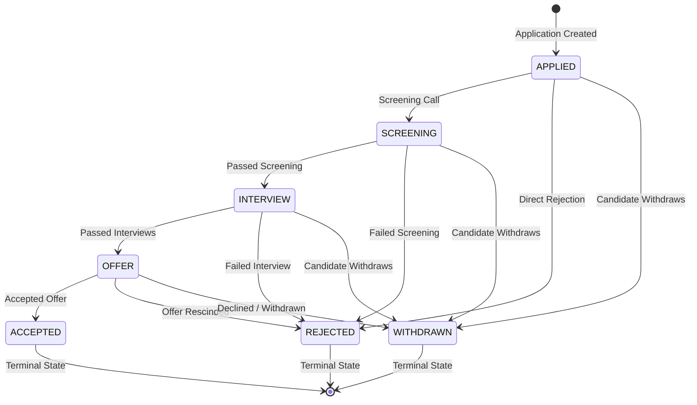
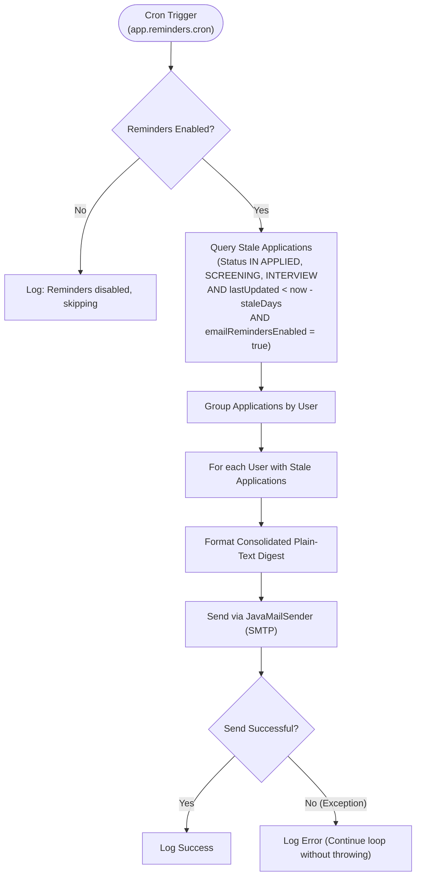
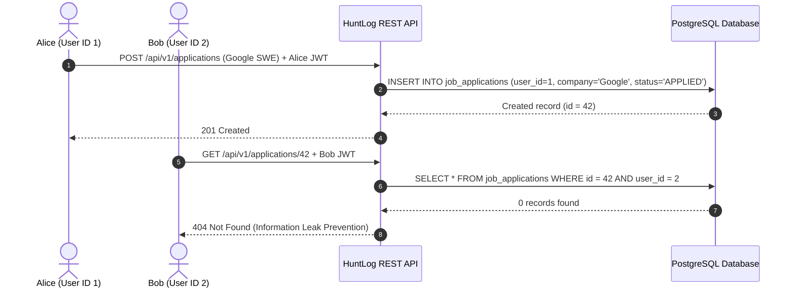
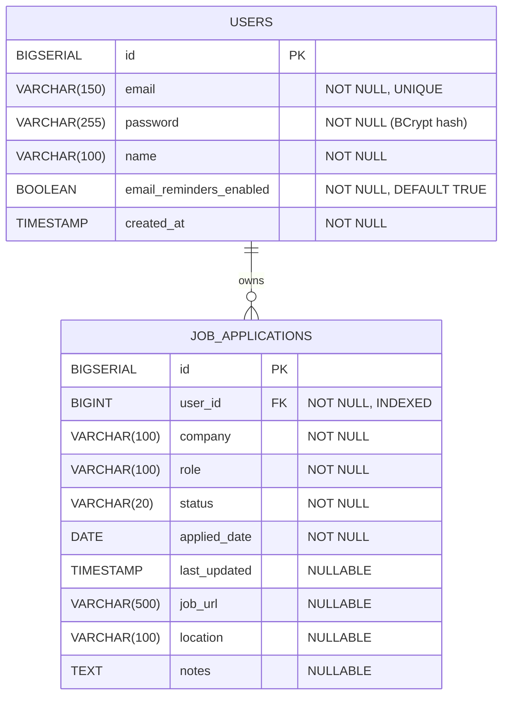

# HuntLog — System Architecture and Technical Design

This document details the architectural decisions, design patterns, state machine mechanics, security model, reminder scheduling pipeline, database schema, and frontend architecture for HuntLog.

---

## 1. High-Level Architecture and Request Flow

HuntLog follows a layered, domain-driven Spring Boot architecture with strict separation of concerns.

---

## 2. State Machine Pipeline

HuntLog enforces hiring lifecycle rules using a deterministic finite state machine to prevent illegal status transitions (such as jumping directly from `APPLIED` to `OFFER`).

### Transition Matrix

| Current Status | Allowed Next Statuses | Terminal State |
|---|---|---|
| `APPLIED` | `SCREENING`, `REJECTED`, `WITHDRAWN` | No |
| `SCREENING` | `INTERVIEW`, `REJECTED`, `WITHDRAWN` | No |
| `INTERVIEW` | `OFFER`, `REJECTED`, `WITHDRAWN` | No |
| `OFFER` | `ACCEPTED`, `REJECTED`, `WITHDRAWN` | No |
| `ACCEPTED` | *None* | Yes |
| `REJECTED` | *None* | Yes |
| `WITHDRAWN` | *None* | Yes |

### Implementation Detail
The state machine is implemented via an immutable `Map<ApplicationStatus, Set<ApplicationStatus>>` in `ApplicationStateMachine.java`. Lookups operate in constant time O(1).

Every API response embeds `allowedNextStatuses: [...]`, enabling client frontends to dynamically render next actions without duplicating transition rules in JavaScript.

---

## 3. Automated Reminder Pipeline

The reminder subsystem identifies neglected job applications and sends consolidated email digests:

### Key Engineering Guarantees
- **Consolidation**: Stale applications are grouped per user so candidates receive one unified summary email instead of multiple disjointed messages.
- **Fault Isolation**: Email dispatch failures for one user are logged without terminating the loop, ensuring remaining users still receive their reminders.
- **Scoped Querying**: Uses JPQL with `JOIN FETCH` to prevent N+1 queries when loading user details.

---

## 4. Frontend Architecture

The frontend is implemented as a lightweight Single Page Application (SPA) without third-party frameworks:
- **Location**: `src/main/resources/static/` (`index.html`, `styles.css`, `app.js`).
- **Routing**: Hash-based routing (`#login`, `#register`, `#dashboard`) with immediate redirection if unauthenticated.
- **Single Service Integration**: Served directly from Spring Boot alongside the REST API, avoiding CORS configuration issues across cloud deployments.
- **State Management**: Lightweight client-side application caching for real-time search and filter without redundant network queries.
- **Security**: JWT stored in `localStorage` for simple client persistence, sent via standard `Authorization: Bearer <token>` headers.

---

## 5. Analytics and Metrics Pipeline

The `AnalyticsService` executes user-scoped aggregate queries to compute real-time metrics:

- **Database Aggregation**: Utilizes Spring Data JPA projections (`CompanyCount`) to calculate top company distribution in PostgreSQL without loading entire entity collections into memory.
- **Response Rate Formula**:
  $$\text{Response Rate} = \frac{\text{Total} - \text{APPLIED} - \text{WITHDRAWN}}{\text{Total}} \times 100$$
- **Velocity Metrics**: Calculates average days from application submission to first status update for active candidates.

---

## 6. Security and Multi-Tenant Data Isolation

### Stateless Authentication
- **Algorithm**: HMAC-SHA512 (`HS512`) with 256+ bit secret keys.
- **Payload Claims**: `sub` (email), `userId` (Long), `name` (String), `iat` (issued at), `exp` (expiration).
- **Password Storage**: Encrypted with `BCryptPasswordEncoder` (salted, 10 rounds).

### Per-User Data Isolation
Every application record is associated with a `user_id` foreign key.

Attempting to access or modify another user's application produces a `404 Not Found` rather than `403 Forbidden`, preventing unauthorized discovery of entity IDs.

---

## 7. Database Schema and Migrations

Database schema versioning is managed via Flyway migrations under `src/main/resources/db/migration`:

### Entity Relationship Diagram

### Migrations Timeline
- `V1__create_job_applications.sql`: Creates initial `job_applications` table with `BIGSERIAL` primary key and timestamps.
- `V2__create_users_and_link_applications.sql`: Creates `users` table, adds `user_id` foreign key constraint, and indexes `idx_job_applications_user_id`.
- `V3__add_email_preferences.sql`: Adds `email_reminders_enabled` boolean column to `users` table for user notification controls.

---

## 8. Global Exception and Error Handling

All controller errors are processed by `GlobalExceptionHandler` and returned in a standard RFC 7807 format:

| Exception | HTTP Status | Meaning |
|---|---|---|
| `DuplicateEmailException` | `409 Conflict` | Email is already registered |
| `BadCredentialsException` | `401 Unauthorized` | Invalid email or password |
| `ResourceNotFoundException` | `404 Not Found` | Application not found or belongs to another user |
| `InvalidStatusTransitionException` | `422 Unprocessable Entity` | Illegal state machine status transition |
| `MethodArgumentNotValidException` | `400 Bad Request` | DTO validation failure (e.g. invalid email) |
| `HttpMessageNotReadableException` | `400 Bad Request` | Malformed JSON in request body |
