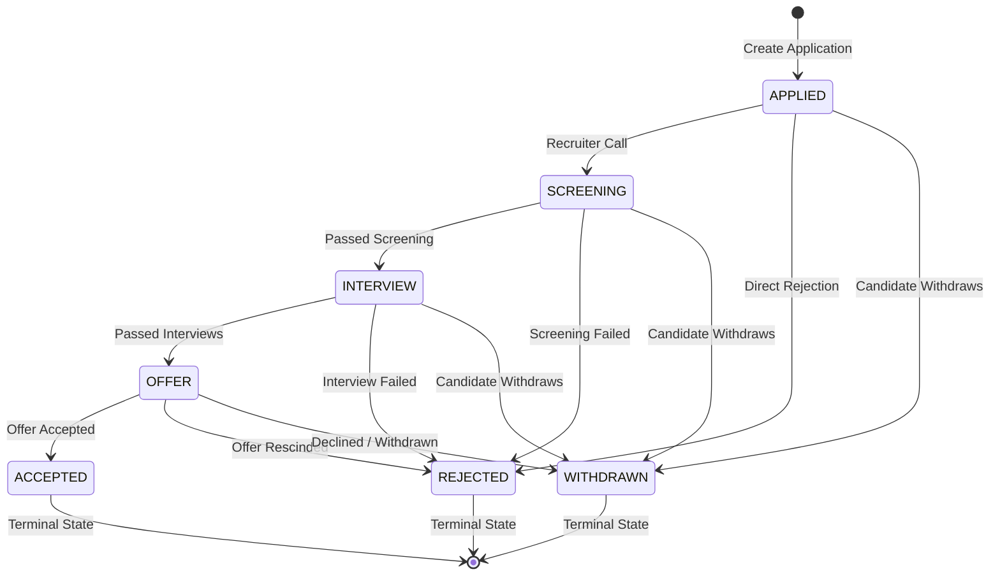

# 📖 HuntLog — Comprehensive User & Developer Guide

HuntLog is a production-ready **Job Application Tracker REST API** built with **Java 21**, **Spring Boot 3.4.1**, **Spring Data JPA**, **Flyway**, and **MySQL 8.0**.

This guide covers everything you need to run, use, test, and integrate with the HuntLog API.

---

## 📑 Table of Contents

1. [System Architecture](#-system-architecture)
2. [State Machine & Workflow](#-state-machine--workflow)
3. [Prerequisites](#-prerequisites)
4. [How to Run](#-how-to-run)
   - [Method 1: Full Stack via Docker Compose](#method-1-full-stack-via-docker-compose-fastest)
   - [Method 2: Local Development with Dockerized MySQL](#method-2-local-development-with-dockerized-mysql-recommended)
   - [Method 3: Local Maven with Existing Local MySQL](#method-3-local-maven-with-existing-local-mysql)
5. [Running Tests](#-running-tests)
6. [API Specification & Endpoints](#-api-specification--endpoints)
7. [Step-by-Step Usage Examples](#-step-by-step-usage-examples)
   - [Scenario A: Create an Application (POST)](#1-create-a-job-application)
   - [Scenario B: List & Filter Applications (GET)](#2-list-and-filter-applications)
   - [Scenario C: Move through the Hiring Pipeline (PUT)](#3-advance-application-through-the-pipeline)
   - [Scenario D: Test State Machine Validation (422 Error)](#4-trigger-state-machine-validation-422-error)
   - [Scenario E: Delete an Application (DELETE)](#5-delete-an-application)
8. [Configuration & Environment Variables](#-configuration--environment-variables)
9. [Troubleshooting & FAQs](#-troubleshooting--faqs)

---

## 🏛 System Architecture

HuntLog follows modern Spring Boot engineering best practices:

- **Controller Layer (`com.pbanakar.huntlog.controller`)**: Exposes REST endpoints, validates inputs via `jakarta.validation`, and handles HTTP request/response lifecycles.
- **Service Layer (`com.pbanakar.huntlog.service`)**: Encapsulates business logic, DTO mapping, and delegates transition validation to the state machine.
- **State Machine (`com.pbanakar.huntlog.statemachine`)**: An $O(1)$ enum transition validator enforcing valid progression through the hiring funnel.
- **Persistence Layer (`com.pbanakar.huntlog.repository`)**: Spring Data JPA repositories communicating with MySQL.
- **Database Migrations (`db/migration`)**: Flyway version-controlled schema definitions.
- **Global Error Handling (`com.pbanakar.huntlog.exception`)**: Centralized `@RestControllerAdvice` returning standard RFC 7807-style error payloads.

---

## 🔄 State Machine & Workflow

HuntLog guarantees that job applications follow realistic lifecycle transitions:



### Transition Rules Table

| Current Status | Allowed Next Statuses | Terminal? |
|---|---|---|
| `APPLIED` | `SCREENING`, `REJECTED`, `WITHDRAWN` | ❌ No |
| `SCREENING` | `INTERVIEW`, `REJECTED`, `WITHDRAWN` | ❌ No |
| `INTERVIEW` | `OFFER`, `REJECTED`, `WITHDRAWN` | ❌ No |
| `OFFER` | `ACCEPTED`, `REJECTED`, `WITHDRAWN` | ❌ No |
| `ACCEPTED` | *None* | ✅ Yes |
| `REJECTED` | *None* | ✅ Yes |
| `WITHDRAWN` | *None* | ✅ Yes |

> **Note**: Every API response includes `allowedNextStatuses: [...]` so client UIs can dynamically enable or disable action buttons without hardcoded front-end logic!

---

## 🧰 Prerequisites

Make sure you have the following installed on your machine:

- **Java JDK 21+**: Verify with `java -version`
- **Apache Maven 3.9+**: Verify with `mvn -version`
- **Docker & Docker Compose**: Verify with `docker --version` and `docker compose version`
- **cURL** or **PowerShell 5.1+** for sending HTTP requests

---

## 🚀 How to Run

### Method 1: Full Stack via Docker Compose (Fastest)

Starts both the MySQL database and the Spring Boot application inside Docker containers.

```powershell
# 1. Build and start containers in the background
docker compose up --build -d

# 2. View logs
docker compose logs -f

# 3. Stop containers when done
docker compose down
```

The API will be available at `http://localhost:8080`.

---

### Method 2: Local Development with Dockerized MySQL (Recommended)

Run MySQL in Docker on port `3307` (to prevent conflict with any local MySQL on `3306`), and run Spring Boot locally for instant debugging and code changes.

```powershell
# Step 1: Start MySQL in Docker
docker compose up mysql -d

# Step 2: Run Spring Boot with Maven
mvn spring-boot:run
```

---

### Method 3: Local Maven with Existing Local MySQL

If you have a local MySQL instance on port `3306`, create the database and run:

```sql
-- In your MySQL shell:
CREATE DATABASE IF NOT EXISTS huntlog;
CREATE USER IF NOT EXISTS 'huntlog'@'%' IDENTIFIED BY 'huntlog';
GRANT ALL PRIVILEGES ON huntlog.* TO 'huntlog'@'%';
FLUSH PRIVILEGES;
```

Then run Spring Boot pointing to port 3306:

```powershell
mvn spring-boot:run -Dspring-boot.run.arguments="--spring.datasource.url=jdbc:mysql://localhost:3306/huntlog?useSSL=false&allowPublicKeyRetrieval=true&serverTimezone=UTC"
```

---

## 🧪 Running Tests

HuntLog has 100% passing automated test coverage across unit tests, service layers, and state machine validation.

```powershell
# Run all unit tests
mvn test

# Run tests and generate verification reports
mvn verify
```

---

## 📡 API Specification & Endpoints

Base URL: `http://localhost:8080/api/v1/applications`

| Method | Endpoint | Description | Status Codes |
|---|---|---|---|
| `POST` | `/api/v1/applications` | Create a new job application | `201 Created`, `400 Bad Request` |
| `GET` | `/api/v1/applications` | List applications (paginated, sorted, filterable) | `200 OK` |
| `GET` | `/api/v1/applications/{id}` | Get application details by ID | `200 OK`, `404 Not Found` |
| `PUT` | `/api/v1/applications/{id}` | Update application details or transition status | `200 OK`, `400 Bad Request`, `404 Not Found`, `422 Unprocessable Entity` |
| `DELETE` | `/api/v1/applications/{id}` | Delete an application | `204 No Content`, `404 Not Found` |

---

## 💡 Step-by-Step Usage Examples

### 1. Create a Job Application

#### PowerShell:
```powershell
Invoke-RestMethod -Uri "http://localhost:8080/api/v1/applications" `
  -Method Post `
  -ContentType "application/json" `
  -Body '{
    "company": "Google",
    "role": "Staff Software Engineer",
    "jobUrl": "https://careers.google.com/jobs/123",
    "location": "Mountain View, CA",
    "notes": "Referred by Alex"
  }'
```

#### cURL (Bash / Command Prompt):
```bash
curl -X POST http://localhost:8080/api/v1/applications \
  -H "Content-Type: application/json" \
  -d '{
    "company": "Google",
    "role": "Staff Software Engineer",
    "jobUrl": "https://careers.google.com/jobs/123",
    "location": "Mountain View, CA",
    "notes": "Referred by Alex"
  }'
```

#### Response (`201 Created`):
```json
{
  "id": 1,
  "company": "Google",
  "role": "Staff Software Engineer",
  "status": "APPLIED",
  "appliedDate": "2026-10-02",
  "lastUpdated": "2026-10-02T13:06:29.196903",
  "jobUrl": "https://careers.google.com/jobs/123",
  "notes": "Referred by Alex",
  "location": "Mountain View, CA",
  "allowedNextStatuses": [
    "SCREENING",
    "REJECTED",
    "WITHDRAWN"
  ]
}
```

---

### 2. List and Filter Applications

Supports pagination (`page`, `size`), sorting (`sort=field,asc|desc`), and filtering (`status`, `company`).

#### PowerShell:
```powershell
# Get all applications (Page 0, 10 items)
Invoke-RestMethod -Uri "http://localhost:8080/api/v1/applications?page=0&size=10&sort=appliedDate,desc" -Method Get

# Filter by company and status
Invoke-RestMethod -Uri "http://localhost:8080/api/v1/applications?company=Google&status=APPLIED" -Method Get
```

#### cURL:
```bash
curl "http://localhost:8080/api/v1/applications?page=0&size=10&sort=appliedDate,desc"
```

#### Response (`200 OK`):
```json
{
  "content": [
    {
      "id": 1,
      "company": "Google",
      "role": "Staff Software Engineer",
      "status": "APPLIED",
      "appliedDate": "2026-10-02",
      "lastUpdated": "2026-10-02T13:06:29.196903",
      "jobUrl": "https://careers.google.com/jobs/123",
      "notes": "Referred by Alex",
      "location": "Mountain View, CA",
      "allowedNextStatuses": ["SCREENING", "REJECTED", "WITHDRAWN"]
    }
  ],
  "pageable": {
    "pageNumber": 0,
    "pageSize": 10
  },
  "totalElements": 1,
  "totalPages": 1,
  "last": true
}
```

---

### 3. Advance Application through the Pipeline

To transition an application to the next stage (or update fields such as salary/notes):

#### Transition: `APPLIED` ➔ `SCREENING`
```powershell
Invoke-RestMethod -Uri "http://localhost:8080/api/v1/applications/1" `
  -Method Put `
  -ContentType "application/json" `
  -Body '{
    "status": "SCREENING",
    "notes": "Recruiter call scheduled for Monday"
  }'
```

#### Transition: `SCREENING` ➔ `INTERVIEW`
```powershell
Invoke-RestMethod -Uri "http://localhost:8080/api/v1/applications/1" `
  -Method Put `
  -ContentType "application/json" `
  -Body '{
    "status": "INTERVIEW",
    "notes": "Technical rounds: System Design & Coding"
  }'
```

#### Transition: `INTERVIEW` ➔ `OFFER`
```powershell
Invoke-RestMethod -Uri "http://localhost:8080/api/v1/applications/1" `
  -Method Put `
  -ContentType "application/json" `
  -Body '{
    "status": "OFFER",
    "notes": "Received offer letter"
  }'
```

#### Transition: `OFFER` ➔ `ACCEPTED` (Terminal)
```powershell
Invoke-RestMethod -Uri "http://localhost:8080/api/v1/applications/1" `
  -Method Put `
  -ContentType "application/json" `
  -Body '{
    "status": "ACCEPTED",
    "notes": "Signed offer! Start date in Nov."
  }'
```

---

### 4. Trigger State Machine Validation (422 Error)

If a user or script tries an invalid state leap (e.g. attempting to jump straight from `APPLIED` to `OFFER` without screening/interviews):

```powershell
# Attempt illegal jump: APPLIED -> OFFER
Invoke-RestMethod -Uri "http://localhost:8080/api/v1/applications/1" `
  -Method Put `
  -ContentType "application/json" `
  -Body '{"status":"OFFER"}'
```

#### Error Response (`422 Unprocessable Entity`):
```json
{
  "timestamp": "2026-10-02T13:07:02.4471647",
  "status": 422,
  "error": "Unprocessable Entity",
  "message": "Cannot transition from APPLIED to OFFER. Allowed transitions: [SCREENING, REJECTED, WITHDRAWN]",
  "path": "/api/v1/applications/1"
}
```

---

### 5. Delete an Application

```powershell
Invoke-RestMethod -Uri "http://localhost:8080/api/v1/applications/1" -Method Delete
```

#### Response: `204 No Content`

---

## ⚙ Configuration & Environment Variables

You can override default settings via standard environment variables or JVM system properties:

| Property | Default Value | Environment Variable | Description |
|---|---|---|---|
| `spring.datasource.url` | `jdbc:mysql://127.0.0.1:3307/huntlog...` | `DB_URL` | MySQL JDBC connection string |
| `spring.datasource.username` | `huntlog` | `DB_USER` | Database username |
| `spring.datasource.password` | `huntlog` | `DB_PASS` | Database password |
| `server.port` | `8080` | `SERVER_PORT` | Port for the HTTP API server |

---

## ❓ Troubleshooting & FAQs

### Q: Why does Docker MySQL use port 3307 instead of 3306?
**A**: Windows and developer machines often have an existing MySQL server running on default port `3306`. Mapping Docker MySQL to host port `3307` prevents port collision while keeping the internal container port as `3306`.

### Q: How do I reset the database completely?
**A**: Run:
```powershell
docker compose down -v
docker compose up mysql -d
```
The `-v` flag removes the MySQL volume so Flyway migrations will re-run clean from `V1__create_job_applications_table.sql`.

### Q: How do I run behind a reverse proxy or with HTTPS?
**A**: Set `server.forward-headers-strategy=native` in `application.yml` and route traffic through Nginx / Traefik / Caddy.
